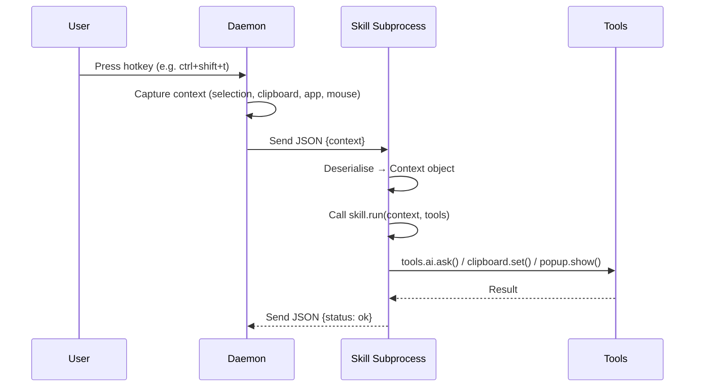
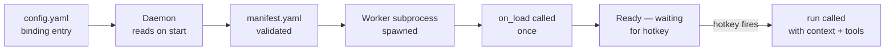
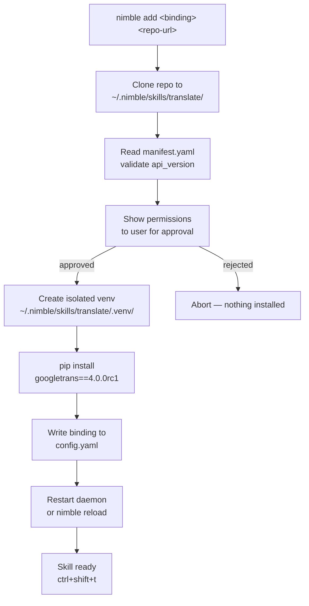

# How to Build a Custom Nimble Skill and Publish It to GitHub

**Audience:** Developers comfortable with Git and CLI tools  
**Goal:** Build a reusable, shareable Nimble skill from scratch, publish it to its own GitHub repository, and let others install it with a single command.

---

## Table of Contents

1. [What Is a Nimble Skill?](#1-what-is-a-nimble-skill)
2. [Prerequisites](#2-prerequisites)
3. [Skill Anatomy](#3-skill-anatomy)
4. [Worked Example: TranslateSkill](#4-worked-example-translateskill)
   - [4.1 Plan the Skill](#41-plan-the-skill)
   - [4.2 Write the Skill Class](#42-write-the-skill-class)
   - [4.3 Write the Manifest](#43-write-the-manifest)
   - [4.4 Register the Skill in config.yaml](#44-register-the-skill-in-configyaml)
   - [4.5 Test the Skill](#45-test-the-skill)
5. [GitHub Repository Structure](#5-github-repository-structure)
6. [Publishing to GitHub](#6-publishing-to-github)
7. [Community Installation](#7-community-installation)
8. [Troubleshooting](#8-troubleshooting)

---

## 1. What Is a Nimble Skill?

Nimble is a cross-platform Python hotkey daemon. When you press a hotkey, it:

1. **Captures context** — the selected text, clipboard content, active app, and mouse position at that exact moment.
2. **Dispatches** the context to a skill running in an isolated subprocess.
3. **The skill acts** — using the captured context and built-in tools (AI, clipboard, popups, TTS, dialogs).

A **skill** is a Python class with a `run()` method. That's it. No framework, no decorators, no imports from Nimble required.



---

## 2. Prerequisites

| Requirement | Version | Purpose |
|---|---|---|
| Python | 3.11+ | Skill runtime |
| pip | any | Installing skill dependencies |
| Git | 2.x+ | Version control |
| GitHub account | — | Publishing the skill |
| GitHub CLI (`gh`) | 2.x+ | Creating releases from terminal |
| Nimble daemon running | — | Testing the skill locally |

Install the GitHub CLI:

```bash
# macOS
brew install gh

# Ubuntu / Debian
sudo apt install gh

# Windows (winget)
winget install GitHub.cli
```

---

## 3. Skill Anatomy

Every Nimble skill consists of two files in a dedicated folder:

```
skills/
└── my_skill/
    ├── skill.py        ← the Python class
    └── manifest.yaml   ← metadata, permissions, dependencies
```

### 3.1 The Skill Class

```python
class MySkill:

    def on_load(self, config):          # optional — called once at daemon start
        pass

    def run(self, context, tools):      # required — called on every hotkey fire
        pass

    def on_error(self, exc):            # optional — called when run() raises
        pass

    def on_unload(self):                # optional — called on graceful shutdown
        pass
```

> **Critical rule:** Do NOT annotate `context` or `tools` with `nimble.*` types. The skill subprocess may not have Nimble installed. Use bare `object` or omit annotations entirely.

#### The `context` object

Four fields — always strings or lists, never `None`:

| Field | Type | Contains |
|---|---|---|
| `context.selection` | `str` | Text selected in the active window |
| `context.clipboard` | `str` | Current clipboard content |
| `context.active_app` | `str` | Active application name (e.g. `"Google Chrome"`) |
| `context.mouse_position` | `list[int]` | `[x, y]` screen coordinates |

#### The `tools` object

Five built-in tools:

| Tool | Method | What it does |
|---|---|---|
| `tools.ai` | `.ask(text, prompt=None) → str` | Queries the configured LLM |
| `tools.popup` | `.show(text) → None` | System desktop notification |
| `tools.clipboard` | `.get() → str` | Reads clipboard |
| `tools.clipboard` | `.set(text) → None` | Writes to clipboard |
| `tools.tts` | `.speak(text) → None` | Text-to-speech |
| `tools.input` | `.ask(prompt) → str \| None` | Text input dialog |
| `tools.input` | `.select(prompt, choices) → str \| None` | Selection dialog |

### 3.2 The Manifest

`manifest.yaml` declares the skill's identity and requirements:

```yaml
name: my_skill            # unique, snake_case, no slashes
version: "1.0.0"          # semver
api_version: 1            # must be ≤ 1 (current SUPPORTED_API_VERSION)
description: "…"          # shown during community install
entrypoint: skill.py      # Python file relative to this manifest
class_name: MySkill       # class name inside entrypoint
permissions: []           # subset of: ai, clipboard, tts, input, popup
dependencies: []          # pip packages — installed into isolated venv
author: "Your Name"
```

### 3.3 The config.yaml Entry

To bind your skill to a hotkey, add an entry to the project's root `config.yaml`:

```yaml
skills:
  - name: my_skill
    source: local
    path: skills/my_skill/skill.py
    class_name: MySkill
    binding: "ctrl+shift+m"
```



---

## 4. Worked Example: TranslateSkill

**TranslateSkill** translates the selected or clipboard text into a language the user chooses at runtime, using the `googletrans` Python library, and copies the result back to the clipboard.

### 4.1 Plan the Skill

| Question | Answer |
|---|---|
| What triggers it? | `ctrl+shift+t` (configurable) |
| What does it read? | `context.selection` if non-empty, else `context.clipboard` |
| What does it ask? | A language code (e.g. `fr`, `de`, `ja`) via input dialog |
| What does it produce? | Translated text written to clipboard + popup confirmation |
| What permissions? | `clipboard`, `popup`, `input` |
| What dependencies? | `googletrans==4.0.0rc1` |

### 4.2 Write the Skill Class

Create `skills/translate/skill.py`:

```python
from googletrans import Translator


class TranslateSkill:

    def on_load(self, config):
        self._translator = Translator()
        self._default_lang = config.get("target_lang", "en")

    def run(self, context, tools):
        text = context.selection or context.clipboard
        if not text.strip():
            tools.popup.show("Nothing to translate — select or copy text first.")
            return

        target = tools.input.ask(
            f"Translate to (e.g. fr, de, ja) [{self._default_lang}]:"
        )
        if target is None:          # user dismissed the dialog
            return
        if not target.strip():
            target = self._default_lang

        try:
            result = self._translator.translate(text, dest=target.strip())
            tools.clipboard.set(result.text)
            tools.popup.show(f"Translated to {result.dest} — copied to clipboard.")
        except Exception as exc:
            tools.popup.show(f"Translation failed: {exc}")

    def on_error(self, exc):
        pass    # run() already handles exceptions with popup; nothing extra needed
```

**How it works, step by step:**

1. `on_load()` — instantiates the `Translator` once at daemon start. Reading `config.get("target_lang", "en")` lets users set a personal default in their `config.yaml` without touching skill code.
2. `run()` — checks for text, asks the user for a target language, calls `googletrans`, writes to clipboard, notifies via popup.
3. Graceful guards — returns early if there is nothing to translate or the user cancels the dialog.

> **Why `googletrans==4.0.0rc1`?** The `4.0.0rc1` release candidate is the stable async-compatible branch. The older `3.x` series has known SSL and JSON parse errors with current Google endpoints.

### 4.3 Write the Manifest

Create `skills/translate/manifest.yaml`:

```yaml
name: translate
version: "1.0.0"
api_version: 1
description: >
  Translates selected or clipboard text to any language using Google Translate.
  Prompts for a target language code at runtime.
entrypoint: skill.py
class_name: TranslateSkill
permissions:
  - clipboard
  - popup
  - input
dependencies:
  - googletrans==4.0.0rc1
author: "Your Name"
```

### 4.4 Register the Skill in config.yaml

Add to the root `config.yaml`:

```yaml
skills:
  - name: translate
    source: local
    path: skills/translate/skill.py
    class_name: TranslateSkill
    binding: "ctrl+shift+t"
```

To pass a personal default language, add a `config` block (optional):

```yaml
  - name: translate
    source: local
    path: skills/translate/skill.py
    class_name: TranslateSkill
    binding: "ctrl+shift+t"
    config:
      target_lang: "fr"
```

The daemon passes the `config` dict to `on_load(config)` on startup.

### 4.5 Test the Skill

Create `tests/unit/skills/test_translate.py`:

```python
import importlib.util
import pathlib
from unittest.mock import MagicMock

import pytest


def _load_skill():
    path = pathlib.Path("skills/translate/skill.py")
    spec = importlib.util.spec_from_file_location("translate_skill", path)
    module = importlib.util.module_from_spec(spec)
    spec.loader.exec_module(module)
    return module.TranslateSkill


class TestTranslateSkill:

    def setup_method(self):
        self.skill = _load_skill()()
        self.skill.on_load({"target_lang": "fr"})

    def _ctx(self, selection="", clipboard=""):
        ctx = MagicMock()
        ctx.selection = selection
        ctx.clipboard = clipboard
        return ctx

    def test_translates_selection_to_chosen_language(self, mocker):
        mock_result = MagicMock()
        mock_result.text = "Bonjour le monde"
        mock_result.dest = "fr"
        mocker.patch.object(
            self.skill._translator, "translate", return_value=mock_result
        )
        tools = MagicMock()
        tools.input.ask.return_value = "fr"

        self.skill.run(self._ctx(selection="Hello world"), tools)

        tools.clipboard.set.assert_called_once_with("Bonjour le monde")
        tools.popup.show.assert_called_once_with(
            "Translated to fr — copied to clipboard."
        )

    def test_falls_back_to_clipboard_when_no_selection(self, mocker):
        mock_result = MagicMock(text="Hallo Welt", dest="de")
        mocker.patch.object(
            self.skill._translator, "translate", return_value=mock_result
        )
        tools = MagicMock()
        tools.input.ask.return_value = "de"

        self.skill.run(self._ctx(clipboard="Hello world"), tools)

        tools.clipboard.set.assert_called_once_with("Hallo Welt")

    def test_uses_default_lang_when_input_empty(self, mocker):
        mock_result = MagicMock(text="Monde", dest="fr")
        mocker.patch.object(
            self.skill._translator, "translate", return_value=mock_result
        )
        tools = MagicMock()
        tools.input.ask.return_value = ""   # user pressed Enter with no input

        self.skill.run(self._ctx(selection="World"), tools)

        self.skill._translator.translate.assert_called_with("World", dest="fr")

    def test_returns_early_when_nothing_to_translate(self):
        tools = MagicMock()
        self.skill.run(self._ctx(selection="", clipboard=""), tools)
        tools.popup.show.assert_called_once_with(
            "Nothing to translate — select or copy text first."
        )

    def test_returns_early_when_dialog_dismissed(self, mocker):
        mocker.patch.object(self.skill._translator, "translate")
        tools = MagicMock()
        tools.input.ask.return_value = None  # user dismissed

        self.skill.run(self._ctx(selection="Hello"), tools)

        self.skill._translator.translate.assert_not_called()

    def test_shows_popup_on_translation_error(self, mocker):
        mocker.patch.object(
            self.skill._translator, "translate", side_effect=RuntimeError("API down")
        )
        tools = MagicMock()
        tools.input.ask.return_value = "fr"

        self.skill.run(self._ctx(selection="Hello"), tools)

        tools.popup.show.assert_called_once()
        assert "Translation failed" in tools.popup.show.call_args[0][0]
```

Run the tests:

```bash
pytest tests/unit/skills/test_translate.py -v
```

---

## 5. GitHub Repository Structure

Community skills live in their **own dedicated repository** so they can be versioned and installed independently. The repository root is what `nimble add` fetches — keep it clean.

### Recommended layout

```
translate-skill/                  ← repository root (= skill root)
├── skill.py                      ← skill entrypoint (required)
├── manifest.yaml                 ← skill manifest (required)
├── README.md                     ← installation + usage guide (required)
├── LICENSE                       ← MIT recommended
├── CHANGELOG.md                  ← version history
└── tests/
    └── test_translate.py         ← unit tests (optional but strongly recommended)
```

> **Why no subdirectory?** `nimble add` installs the repository root directly into `~/.nimble/skills/<name>/`. Putting `skill.py` and `manifest.yaml` at the root avoids path indirection.

### Naming conventions

| Item | Convention | Example |
|---|---|---|
| Repository name | `nimble-<topic>-skill` | `nimble-translate-skill` |
| `name` in manifest.yaml | `snake_case` | `translate` |
| Skill class name | `PascalCase` + `Skill` suffix | `TranslateSkill` |
| Hotkey (user's choice) | `ctrl+shift+<key>` | `ctrl+shift+t` |
| Version | semver | `1.0.0` |

---

## 6. Publishing to GitHub

### Step-by-step

```bash
# 1. Create the repository directory
mkdir nimble-translate-skill && cd nimble-translate-skill

# 2. Copy your skill files to the repo root
cp /path/to/skills/translate/skill.py      .
cp /path/to/skills/translate/manifest.yaml .
mkdir tests
cp /path/to/tests/unit/skills/test_translate.py tests/

# 3. Initialise git
git init
git branch -M main

# 4. Write README.md  (see template below)

# 5. Add a LICENSE
# Visit https://choosealicense.com — MIT is standard for community skills

# 6. First commit
git add .
git commit -m "feat: initial release of nimble-translate-skill v1.0.0"

# 7. Create the remote repo via GitHub CLI
gh repo create nimble-translate-skill --public --source=. --remote=origin --push

# 8. Tag the release
git tag v1.0.0
git push origin v1.0.0
gh release create v1.0.0 --title "v1.0.0" --notes "Initial release — Google Translate integration"
```

### README template

````markdown
# nimble-translate-skill

A [Nimble](https://github.com/your-org/pixi) skill that translates selected
or clipboard text to any language using Google Translate.

## Requirements

- Nimble daemon installed and running
- Python 3.11+
- Internet connection (calls Google Translate API)

## Installation

```bash
nimble add ctrl+shift+t https://github.com/<your-username>/nimble-translate-skill
```

This command:
- Clones the skill to `~/.nimble/skills/translate/`
- Creates an isolated virtualenv and installs `googletrans`
- Adds the hotkey binding to your Nimble config

## Usage

1. Select some text or copy it to the clipboard.
2. Press `ctrl+shift+t`.
3. Type a language code (e.g. `fr`, `de`, `ja`) and press Enter.
4. The translated text is copied to your clipboard.

### Supported language codes (examples)

| Language | Code |
|---|---|
| French | fr |
| German | de |
| Spanish | es |
| Japanese | ja |
| Chinese (Simplified) | zh-cn |
| Arabic | ar |

Full list: [Google Translate language codes](https://cloud.google.com/translate/docs/languages)

## Configuration

To set a default target language, edit your `config.yaml` after install:

```yaml
skills:
  - name: translate
    binding: "ctrl+shift+t"
    config:
      target_lang: "fr"     # ← your default language
```

## License

MIT
````

---

## 7. Community Installation

Anyone who wants to use your skill runs a single command:

```bash
nimble add ctrl+shift+t https://github.com/<your-username>/nimble-translate-skill
```

The `nimble add` command:



### Manual installation (no CLI)

If the `nimble add` command is unavailable:

```bash
# 1. Clone the skill to the community skills directory
git clone https://github.com/<username>/nimble-translate-skill \
    ~/.nimble/skills/translate

# 2. Create an isolated virtualenv and install dependencies
python3 -m venv ~/.nimble/skills/translate/.venv
~/.nimble/skills/translate/.venv/bin/pip install googletrans==4.0.0rc1

# 3. Add the binding to config.yaml
#    (edit manually — see section 3.3 for the config.yaml entry format,
#     set source: community and path: ~/.nimble/skills/translate/skill.py)

# 4. Reload the daemon
nimble reload   # or restart it
```

### Pinning to a specific version

```bash
# Install a specific release tag
nimble add ctrl+shift+t https://github.com/<username>/nimble-translate-skill@v1.0.0
```

---

## 8. Troubleshooting

### Skill does not load at daemon start

| Symptom | Likely cause | Fix |
|---|---|---|
| No popup, hotkey silent | `class_name` mismatch | Verify `class_name` in `config.yaml` matches the Python class name exactly |
| "api_version too high" in logs | Nimble daemon is older than the skill | Update Nimble, or set `api_version: 1` in manifest.yaml |
| "path not found" on startup | Wrong `path` in config.yaml | Use a path relative to the repository root; check it with `ls <path>` |
| `on_load` raises | Dependency not installed | Run `pip install googletrans==4.0.0rc1` in the correct environment |

### googletrans errors at runtime

| Error | Cause | Fix |
|---|---|---|
| `AttributeError: 'NoneType'` | Rate-limited by Google | Add `import time; time.sleep(1)` between calls |
| `JSONDecodeError` | Outdated googletrans | Reinstall: `pip install --force-reinstall googletrans==4.0.0rc1` |
| `httpx.ConnectError` | No internet / proxy | Check connectivity; set `HTTP_PROXY` env var if behind a proxy |
| Dialog never appears | `input` tool unavailable | Confirm your desktop environment supports GTK/Qt dialogs |

### Checking daemon logs

```bash
# Tail daemon output
nimble logs

# Run daemon in foreground (verbose) for debugging
nimble start --foreground --verbose
```

### Verifying the skill loaded correctly

```bash
nimble list
```

Shows all registered skills with their status (`ok`, `disabled`, `error`). If `translate` is listed as `error`, the skill's `on_load()` raised — check logs for the exception.

---

*Built with Paige — the BMAD Technical Documentation Specialist.*
